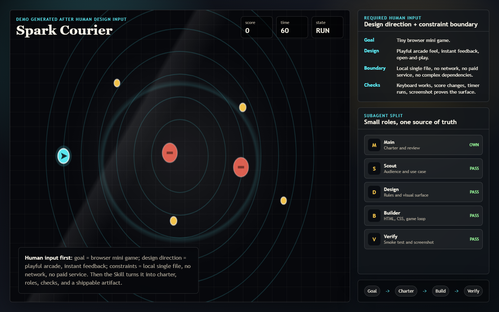

# 普通人也能做产品经理

`anyone-can-product-manager` 是一个把普通人从“反复给 AI 下指令、反复审批、反复补洞”里解放出来的 Skill。

它的核心不是 workflow，而是 **目标驱动的自主产品循环**：人只负责说清楚目标、设计方向和不能越界的约束；主 Agent 负责守住目标和验收；子 Agent 负责调研、设计、约束、开发、验证和持续修正。没有达到目标，就不会因为“已经写了计划”或“差不多能用”而停下。



## 这个 Skill 解决什么问题

传统 AI 使用经常变成这样：

```text
人提需求 -> AI 输出 -> 人审批 -> 人补充 -> AI 再输出 -> 人再审批 -> 结果仍然半成品
```

这个 Skill 要变成这样：

```text
粗略目标 -> 人工输入设计方向与约束边界 -> Product Charter -> 子 Agent 分工 -> 主 Agent 审查 -> 验证 -> 修正 -> 可交付产物
```

注意：**设计方向和约束边界必须由人输入。**

AI 可以帮你把目标写清楚，可以帮你拆任务，可以帮你做产品经理日常的大量判断，但它不能擅自替你决定“你想要什么风格”和“哪些东西不能碰”。这两个输入是自主循环的刹车和方向盘。

## 必须人工输入的两件事

| 输入 | 必须回答什么 | 例子 |
| --- | --- | --- |
| 设计方向 | 你希望产品长成什么感觉、走什么路线、优先什么体验 | 最快 MVP、精致演示、好玩、严肃、技术感、视觉化、低成本、强交互 |
| 约束边界 | AI 不能越过哪些线 | 不花钱、不联网、不发布、不碰隐私数据、只做本地文件、不要复杂框架、必须中文 |

这两个字段没有拿到之前，主 Agent 不能进入 autonomous loop。

## Agent 怎么分工

| 角色 | 责任 |
| --- | --- |
| Main Agent | 维护 Product Charter、目标、约束、验收标准、最终审查 |
| Product Scout | 补足用户场景、使用者、机会点和默认假设 |
| Design Agent | 把设计方向变成体验结构、页面/功能/规则 |
| Constraint Agent | 把约束边界变成硬规则、风险列表和不能碰的线 |
| Builder Agent | 产出文件、应用、文档、原型或代码 |
| Verification Agent | 检查是否满足验收标准，失败就要求修正 |

主 Agent 不是转发员，而是目标守门人。子 Agent 可以提出建议，但不能重写人的目标、设计方向和约束边界。

## Demo：一句话做一个小游戏

用户不是直接说“帮我写代码”，而是先给三样东西：

```text
目标：我想做一个浏览器小游戏。
设计方向：要好玩、直观、有一点街机感，打开就能玩。
约束边界：只做本地单文件，不联网，不用付费服务，不要复杂依赖。
```

Skill 会把它收敛成：

| 产品层 | 产出 |
| --- | --- |
| Product Charter | 60 秒内可玩的浏览器小游戏 |
| Core Loop | 移动、收集光点、避开障碍、刷新分数 |
| Design Rule | 即时反馈、低学习成本、画面有张力 |
| Constraint Rule | 本地 HTML/CSS/JS，无依赖、无联网、无发布 |
| Verification | 能打开、能移动、分数变化、倒计时存在、截图可验证 |

demo 文件在 [`examples/mini-game/index.html`](examples/mini-game/index.html)。

## 为什么它适合“普通人做产品经理”

- 你不需要会写 PRD。
- 你不需要知道怎么拆技术任务。
- 你不需要每一步审批 AI。
- 你只需要给目标、设计方向、约束边界。
- 剩下交给 Main Agent 和子 Agent 循环推进。

它不是让 AI 替你拥有审美和边界，而是让 AI 在你给定的方向和边界里，自动完成产品经理的拆解、推进和验收。

## 仓库结构

```text
.
├── SKILL.md
├── README.md
├── agents/
│   └── ai.yaml
├── assets/
│   └── demo-mini-game.png
├── examples/
│   └── mini-game/
│       └── index.html
└── references/
    └── agent-loop-protocol.md
```

## 使用方式

```text
Use $anyone-can-product-manager to turn my rough product goal into an autonomous build loop.
```

然后按这个格式给输入：

```text
目标：我想做一个帮助我学习的工具。
设计方向：轻量、中文、像每日行动清单一样直接。
约束边界：不联网、不用付费 API、不读取隐私文件，先做本地 demo。
```

## 验证

在仓库根目录运行：

```powershell
python "C:\Users\admin\.codex\skills\.system\skill-creator\scripts\quick_validate.py" "."
```

期望输出：

```text
Skill is valid!
```
