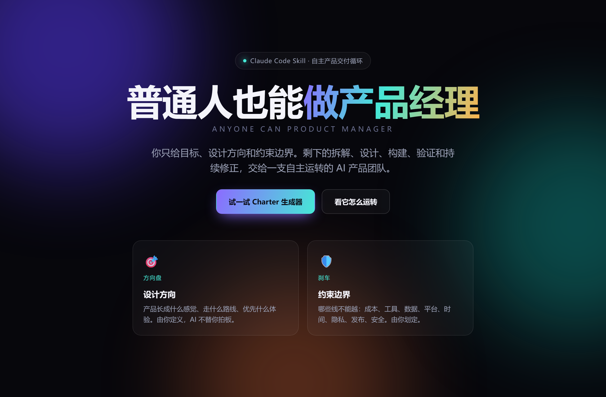

<div align="center">

# 普通人也能做产品经理

### Anyone Can Product Manager

**一个把普通人从「反复给 AI 下指令、反复审批、反复补洞」里解放出来的 Claude Code 技能。**

你只负责说清楚目标、设计方向和不能越界的约束；剩下的拆解、设计、构建、验证与持续修正，交给一支自主运转的 AI 产品团队。

<br>


</div>

---

## 30 秒理解

它的核心不是 workflow，而是 **目标驱动的自主产品循环**。

人只做两件机器不该替你拍板的事——给**方向盘**（设计方向）和**刹车**（约束边界）。其余的产品经理日常判断，由主 Agent 守住目标、子 Agent 分工推进。没达到目标，它不会因为「已经写了计划」或「差不多能用」就停下。

```text
粗略目标 → 人工输入设计方向与约束边界 → Product Charter
        → 子 Agent 分工 → 主 Agent 审查 → 验证 → 修正 → 可交付产物
```



## 在线 Demo

仓库自带一个**自包含、零依赖、可交互**的展示页，打开就能玩——输入一句粗略目标、选好方向和边界，亲眼看技能如何把它收敛成一份 Product Charter 并启动自主循环。

| Demo | 说明 | 文件 |
| --- | --- | --- |
| 🎛️ 交互式展示页 | 内置 **Charter 生成器**：一句话目标 → 实时生成产品宪章 + 点亮交付循环，并展示团队分工、交付循环与技能编排 | [`examples/showcase/index.html`](examples/showcase/index.html) |

> 用浏览器直接打开任一文件即可，无需联网、无需安装任何依赖。

## 它解决什么问题

传统 AI 使用经常把人变成项目经理：

```text
人提需求 → AI 输出 → 人审批 → 人补充 → AI 再输出 → 人再审批 → 结果仍是半成品
```

这个 Skill 把关系反过来：人给方向，AI 当 PM。

AI 可以帮你把目标写清楚、帮你拆任务、帮你做产品经理日常的大量判断，但它不能擅自替你决定「你想要什么风格」和「哪些东西不能碰」。**这两个输入是自主循环的方向盘和刹车。**

## 必须人工输入的两件事

| 输入 | 必须回答什么 | 例子 |
| --- | --- | --- |
| 🎯 设计方向 | 你希望产品长成什么感觉、走什么路线、优先什么体验 | 最快 MVP、精致演示、好玩、严肃、技术感、视觉化、低成本、强交互 |
| 🛡️ 约束边界 | AI 不能越过哪些线 | 不花钱、不联网、不发布、不碰隐私数据、只做本地文件、不要复杂框架、必须中文 |

拿到这两个字段之前，主 Agent 不会进入 autonomous loop。

## 能力亮点

本版本结合了 Fable 5 的运作方式，让技能从「硬写交付物」升级为「会用工具的产品团队」：

- **🧩 编排你已装的技能** —— 要做 PPT 就走 `pptx`，要做 Word 走 `docx`，表格走 `xlsx`，PDF 走 `pdf`，网页/界面走 `frontend-design`，学术写作、配图、文献等领域任务走对应技能。已有技能能做好的事，绝不重新造轮子。
- **📦 自己决定交付物形态** —— 自动区分「要落成文件/产物」（应用、报告、文章、PPT、表格、PDF、>20 行代码、需存档的追踪器）和「对话里说清楚就够」（策略、总结、提纲、解释），不再把该交付的东西停在「描述」阶段。
- **🎯 输入提取、不重复追问** —— 你在需求里已给过的方向或约束，会被直接提取进 Charter 并一行确认，只追问真正缺的那一项，且追问时给具体可选项。
- **🤝 需要外部服务时** —— 建议你连接 MCP 连接器，而不是假装集成，也不会替你擅自选服务商。

## Agent 怎么分工

| 角色 | 责任 |
| --- | --- |
| 🧭 Main Agent | 维护 Product Charter、目标、约束、验收标准、最终审查 |
| 🔭 Product Scout | 补足用户场景、使用者、机会点和默认假设 |
| 🎨 Design Agent | 把设计方向变成体验结构、页面/功能/规则 |
| 🛡️ Constraint Agent | 把约束边界变成硬规则、风险列表和不能碰的线 |
| 🔨 Builder Agent | 产出文件、应用、文档、原型或代码（优先通过已装技能构建） |
| ✅ Verification Agent | 检查是否满足验收标准，失败就要求修正并给证据 |

主 Agent 不是转发员，而是目标守门人。子 Agent 可以提出建议，但不能重写人的目标、设计方向和约束边界。

## 一句话造一个小游戏

用户不直接说「帮我写代码」，而是先给三样东西：

```text
目标：我想做一个浏览器小游戏。
设计方向：要好玩、直观、有一点街机感，打开就能玩。
约束边界：只做本地单文件，不联网，不用付费服务，不要复杂依赖。
```

Skill 会把它收敛成：

| 产品层 | 产出 |
| --- | --- |
| Product Charter | 60 秒内可玩的浏览器小游戏 |
| Core Loop | 移动、收集光点、避开障碍、刷新分数 |
| Design Rule | 即时反馈、低学习成本、画面有张力 |
| Constraint Rule | 本地 HTML/CSS/JS，无依赖、无联网、无发布 |
| Verification | 能打开、能移动、分数变化、倒计时存在、截图可验证 |

在展示页的 Charter 生成器里可以亲手跑这个例子：[`examples/showcase/index.html`](examples/showcase/index.html)。

## 为什么它适合「普通人做产品经理」

- 你不需要会写 PRD。
- 你不需要知道怎么拆技术任务。
- 你不需要每一步审批 AI。
- 你只需要给目标、设计方向、约束边界。
- 剩下交给 Main Agent 和子 Agent 循环推进。

它不是让 AI 替你拥有审美和边界，而是让 AI 在你给定的方向和边界里，自动完成产品经理的拆解、推进和验收。

## 仓库结构

```text
.
├── SKILL.md                      # 技能主体
├── README.md
├── references/
│   └── agent-loop-protocol.md    # 多 Agent / 多轮迭代的详细协议
├── examples/
│   └── showcase/index.html       # 交互式展示页（Charter 生成器）
└── assets/
    └── demo-showcase.png
```

## 安装到各类 Agent

本技能遵循 [agentskills.io](https://agentskills.io) 通用规范——一个以技能名命名的文件夹，内含带 `name` / `description` 前言的 `SKILL.md`。**安装 = 把这个文件夹放进对应 Agent 的 skills 目录，然后重启 / 新开会话让它重新发现技能。**

先把仓库拉到本地，下面所有命令都在仓库根目录执行：

```bash
git clone https://github.com/PoseZhaoyutao/AgentMaker.git
cd AgentMaker
```

### Claude Code

技能目录：`~/.claude/skills/`

```powershell
# Windows · PowerShell
$dst = "$env:USERPROFILE\.claude\skills\anyone-can-product-manager"
New-Item -ItemType Directory -Force $dst | Out-Null
Copy-Item SKILL.md, README.md $dst -Force
Copy-Item references, examples, assets $dst -Recurse -Force
```

```bash
# macOS / Linux
mkdir -p ~/.claude/skills/anyone-can-product-manager
cp -r SKILL.md README.md references examples assets ~/.claude/skills/anyone-can-product-manager/
```

### Codex

技能目录：`~/.codex/skills/`。结构相同，额外带上 `agents/ai.yaml` 可提供中文显示名「普通人也能做产品经理」。

```powershell
# Windows · PowerShell
$dst = "$env:USERPROFILE\.codex\skills\anyone-can-product-manager"
New-Item -ItemType Directory -Force $dst | Out-Null
Copy-Item SKILL.md, README.md $dst -Force
Copy-Item references, examples, assets, agents $dst -Recurse -Force
```

```bash
# macOS / Linux
mkdir -p ~/.codex/skills/anyone-can-product-manager
cp -r SKILL.md README.md references examples assets agents ~/.codex/skills/anyone-can-product-manager/
```

### 其他 Agent（Copilot CLI、Gemini CLI 等）

只要 Agent 支持 agentskills.io 规范，做法一致：把整个技能文件夹放进它的 skills 目录，重启 Agent。

- **GitHub Copilot CLI** —— 从已安装的插件中自动发现技能；把技能放进你的 Copilot 插件所暴露的 skills 目录即可。
- **Gemini CLI** —— 会话开始时加载技能元数据，再通过 `activate_skill` 激活。
- **任意兼容 Agent** —— 找到它的「skills / 技能」目录，把 `anyone-can-product-manager/` 整个拷进去。SKILL.md 的前言是跨平台通用的。

安装后，在对应 Agent 里描述一个粗略目标即可触发；也可以显式调用 `anyone-can-product-manager`。

## 使用方式

```text
Use anyone-can-product-manager to turn my rough product goal into an autonomous build loop.
```

然后按这个格式给输入：

```text
目标：我想做一个帮助我学习的工具。
设计方向：轻量、中文、像每日行动清单一样直接。
约束边界：不联网、不用付费 API、不读取隐私文件，先做本地 demo。
```

## 验证

在仓库根目录运行：

```powershell
$env:PYTHONUTF8 = "1"
python "C:\Users\admin\.codex\skills\.system\skill-creator\scripts\quick_validate.py" "."
```

期望输出：

```text
Skill is valid!
```

---

<div align="center">

**给方向，不当 PM。**

</div>
