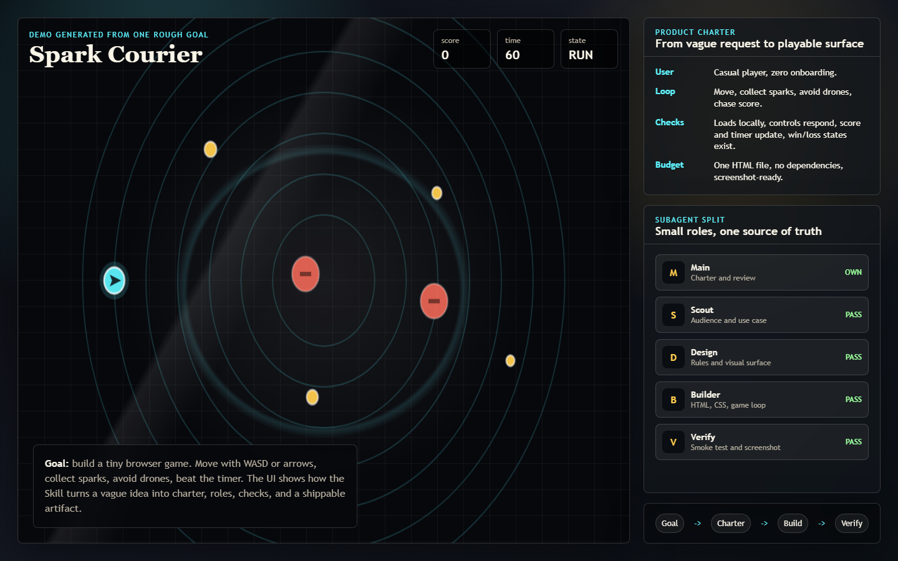

# 普通人也能做产品经理

`anyone-can-product-manager` is a Skill for turning a rough idea into an autonomous product-delivery loop.

You give the AI a goal. The Main Agent turns it into a Product Charter, asks only the few boundary questions that matter, delegates scoped work to Subagents, reviews every result against success checks, and keeps revising until there is a usable deliverable.



## What It Changes

Most AI workflows still make the human act like the project manager:

```text
prompt -> output -> human approval -> more prompt -> more approval -> partial result
```

This Skill flips the loop:

```text
rough goal -> Product Charter -> Subagent work -> Main Agent review -> verification -> revision -> deliverable
```

The human sets the destination and hard boundaries. The AI team owns the route.

## Core Capabilities

- **Goal rewriting**: turns vague wishes into product outcomes and acceptance checks.
- **Minimal questioning**: asks up to three short boundary questions, then proceeds with safe defaults.
- **Autonomous delegation**: splits work across scout, design, constraint, builder, and verification roles.
- **Main Agent governance**: keeps one source of truth for goal, constraints, evidence, and revision state.
- **No approval treadmill**: routine decisions stay inside the autonomy boundary.
- **Token economy**: compresses state, limits Subagent output, and avoids repeating long history.
- **Stop discipline**: does not stop at a plan or first draft; stops only when checks pass or a real blocker appears.

## Demo: A Mini Game From One Rough Goal

Example user input:

```text
I want a tiny browser game, but I do not know how to design it.
```

The Skill turns that into a compact product loop:

| Product layer | Result |
| --- | --- |
| Goal | A playable 60-second browser mini game |
| User | Casual player who wants instant fun |
| Core loop | Move, collect sparks, avoid drones, beat the timer |
| Subagents | Scout defines audience, Design shapes the game, Constraint checks scope, Builder creates HTML/CSS/JS, Verification tests playability |
| Success checks | Loads locally, keyboard controls work, score updates, win/loss states appear |

The screenshot above comes from [`examples/mini-game/index.html`](examples/mini-game/index.html), a small demo artifact created to show how the Skill converts a loose request into a concrete product surface.

## Folder Structure

```text
anyone-can-product-manager/
  SKILL.md
  README.md
  agents/
    ai.yaml
  assets/
    demo-mini-game.png
  examples/
    mini-game/
      index.html
  references/
    agent-loop-protocol.md
```

## Use It

Invoke:

```text
Use $anyone-can-product-manager to turn my rough product goal into an autonomous build loop.
```

Then provide a rough goal:

```text
I want an app that helps me turn study goals into daily actions.
```

The Skill will create a Product Charter, set an autonomy boundary, split work, verify outputs, and keep looping until the deliverable is real enough to use.

## Files

- [`SKILL.md`](SKILL.md): core instructions for the Main Agent and Subagent loop.
- [`references/agent-loop-protocol.md`](references/agent-loop-protocol.md): detailed protocol for multi-agent iteration, context compression, verification, and escalation.
- [`agents/ai.yaml`](agents/ai.yaml): UI-facing metadata.
- [`examples/mini-game/index.html`](examples/mini-game/index.html): demo product surface.

## Validate

From the repository root:

```powershell
python "C:\Users\admin\.codex\skills\.system\skill-creator\scripts\quick_validate.py" "skills\anyone-can-product-manager"
```

Expected:

```text
Skill is valid!
```
